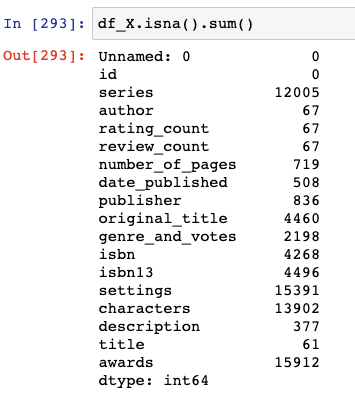
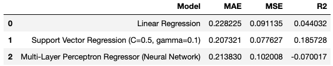
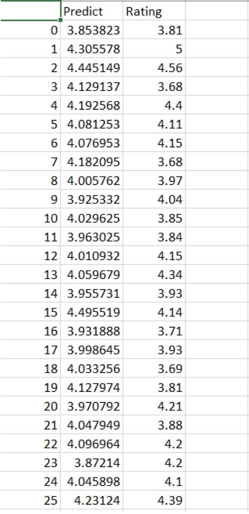

<h1>BÁO CÁO ĐỒ ÁN CUỐI KÌ -NHẬP MÔN KHOA HỌC DỮ LIỆU</h1>
<h2>Cấu trúc folder đồ án</h2>

- **images:** chứa các hình ảnh screenshot
- **Rating:** chứa file **code** và **dataset** của **bài toán**
- **README.MD:** chứa báo cáo đồ án
<h2>1. Thành viên nhóm và phân công</h2>

* Thành viên
  - Nguyễn Văn Tuấn B19DCCN616
  - Phan Thanh Hải B19DCCN219

<h2>2. Tổng quan đồ án</h2>

2.1. **Phát biểu bài toán**

- **Bài toán:** Dự đoán **rating của 1 cuốn sách** theo đánh giá của trang [Good reads](https://www.goodreads.com/) với tập dữ liệu gồm **22.500 entries**

  2.2. **Quá trình thực hiện đồ án** :

  - \*\*Dự đoán rating của một cuốn sách thông qua đánh giá của trang [Good reads](https://www.goodreads.com/), và sử dụng mô hình học máy để đưa ra kết quả cần thiết

<h2>3. Phân tích chi tiết</h2>

**3.1. Bài toán 2:**

- Dữ liệu thu thập được gồm **22.500 dòng** với **20 trường dữ liệu**.
- **Mô tả các biến:**

  - **id** : ID của cuốn sách
  - **title** : Tên của cuốn sách
  - **link** : đường link dẫn đến cuốn sách đó
  - **series**: Cuốn sách này có nằm trong series nào ko ?
  - **author** : tác giả cuốn sách
  - **author_link**: đường link dẫn đến thông tin về tác giả
  - **rating_count**: Số lượng người rating
  - **review_count**: Số lượng người để lại review
  - **number_of_Pages** : Số trang của cuốn sách
  - **date_published**: Ngày được xuất bản
  - **publisher** : Nhà xuất bản
  - **original_title** : Tên gốc
  - **genre_and_votes**: Thể loại và lượt bình chọn
  - **isbn** : Mã số tiêu chuẩn quốc tế cho sách
  - **isbn13**: Mã vạch
  - **settings** : Bối cảnh diễn ra chính trong cuốn sách
  - **characters**: Các nhân vật trong cuốn sách
  - **description**: Tóm tắt cuốn sách
  - **awards** : Các giải thưởng mà cuốn sách nhận được
  - **rating** : đánh giá trung bình của người đọc

- **Cách thu thập dữ liệu:**
  - Bước 1: Vào link ["list book on good reads"](https://www.goodreads.com/list/show/1.Best_Books_Ever) lấy ra link của tất cả các cuốn sách có trong goodread.
  - Bước 2: Từ đó sẽ vào từng link đã thu thập được ở trên để lấy thông tin chi tiết của từng cuốn sách. Cách làm là : chia dữ liệu ra làm nhiều phần để crawl trên colab nhằm giảm bớt thời gian lấy dữ liệu. Với mỗi trang colab ta lấy được 1 file csv.
  - Bước 3: Gộp hết vào thành 1 file [csv](/Rating/dataset.csv) duy nhất và sử dụng python và anaconda để làm các bước tiếp theo.

&#8594; **Tóm lại:** Hầu như tất cả các trường dữ liệu thu thập được đều có ít nhiều ảnh hưởng đến rating của cuốn sách . Một số khác như link , isbn , isbn13 ,… thì ko ảnh hưởng đến nên sẽ bị xóa đi trong quá trình xây dựng model. Chi tiết đều được viết đầy đủ trong file: [Predict.ipynb](/Rating/Predict.ipynb)

- **Tiền xử lý dữ liệu:**

  - Drop 2 cột **link** , **author_link** do không liên quan đến sách và cột **settings** do quá nhiều **null values**. 
  - Xử lý data ở cột **series**: dữ liệu crawl được có dạng **(abc #x) &#8594; abc**
  - Xử lý data ở cột **date_published**: do có dòng có ngày đầy đủ, có ngày chỉ có năm &#8594; chuyển tất cả về năm.
  - Một số xử lý khác: được trình bày chi tiết trong file **[Predict.ipynb](/Rating/Predict.ipynb)**

- **Chạy thuật toán đoán giá**:

  - Bước 1: chia dữ liệu thành 2 tập
    - Tập train: x_train, y_train
    - Tập valid: x_valid, y_valid
  - Bước 2: Training data:

  ```python
  def save_model(model,model_name):
    with open(model_name + '.pkl', 'wb') as f:
      pickle.dump(model, f, pickleHIGHEST_PROTOCOL)

  def load_model(model_name):
    with open(model_name + '.pkl', 'rb') as f:
      return pickle.load(f)
  ```

  ```python
   from sklearn.svm import SVR
   from sklearn.pipeline import make_pipeline
   from sklearn.neural_network import MLPRegressor
   from sklearn.preprocessing import StandardScaler
  ```

  ```python
    # Linear Regression
    reg_LR = make_pipeline(StandardScaler(), LinearRegression())
    # Support Vector Regression
    reg_SVR = make_pipeline(StandardScaler(), SVR(C=0.5, gamma=0.1))
    # MLP Regression
    reg_MLPR = make_pipeline(StandardScaler(), MLPRegressor(random_state=1, max_iter=500))
  ```

- **Đánh giá thuật toán:**:
  - Với kết quả tập test chênh lệch khá thấp so với rating thực như hình dưới đây. Ta có thể thấy mô hình đã hoạt động rất tốt
    
    

<h2>4. Hướng dẫn chạy các file code</h2>

- **Bài toán: đánh giá rating**
  - **Book_1.csv** : File lưu đường link của các cuốn sách trên trang goodread đã thu thập được
  - **X.csv** : File lưu giữ thông tin cụ thể của từng cuốn sách( không có rating)
  - **Y.csv** : File lưu giữ thông tin về rating của từng cuốn sách
  - **Colab.txt** : Lưu đường link dẫn đến file crawl data
  - **Predict.csv** : Lưu kết quả dự đoán mô hình và kết quả thực trên trang goodread<br><br>
