<h1>BÁO CÁO CUỐI KÌ -NHẬP MÔN KHOA HỌC DỮ LIỆU</h1>
<h2>Cấu trúc folder đồ án</h2>

- **Chotot:** chứa file **code** và **datasdet** của **bài toán 1**
- **images:** chứa các hình ảnh screenshot
- **README.MD:** chứa báo cáo đồ án
  <h2>1. Thành viên nhóm</h2>

  -Nguyễn Văn Tuấn -B19DCCN616
  -PHan Thanh Hải - B19DCCN219

<h2>2. Tổng quan đồ án</h2>

2.1. **Phát biểu bài toán**

- **Bài toán:** Dự đoán giá chung cư khu vực thành phố Hồ Chí Minh với tập dữ liêụ **24.949 entries** từ trang [Chợ tốt](https://nha.chotot.com/)
  2.2. **Quá trình thực hiện **

<h2>3. Phân tích chi tiết</h2>
 - **Quá trình**:Dự đoán giá chung cư và nhà ở** của khu vực **thành phố Hồ Chí Minh**. Sau đó, sử dụng phương pháp **parse HTML** để thu thập dữ liệu từ trang [Chợ tốt](https://nha.chotot.com/).
    - Thông tin về dữ liệu thu thập được: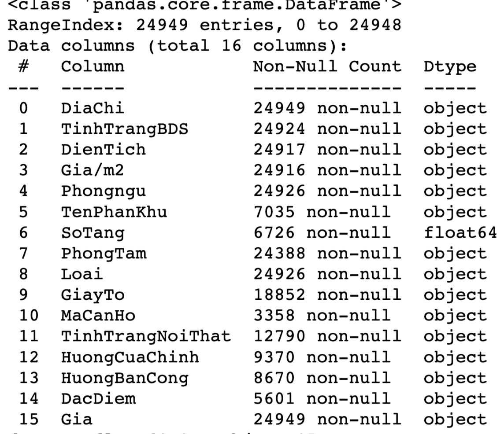  
    - Vấn đề: Ở đây dữ liệu thiếu khá nhiều, và sẽ có một số cột không ảnh hưởng đến output giá chung cư nên sẽ phải tiền xử lý, trực quan hoá các cột dữ liệu để tìm ra dữ liệu nào được giữ lại để xây dựng cho quá trình traning
**3.1. Bài toán:**

- Dữ liệu sau khi thu thập được bao gồm 24949 dòng: 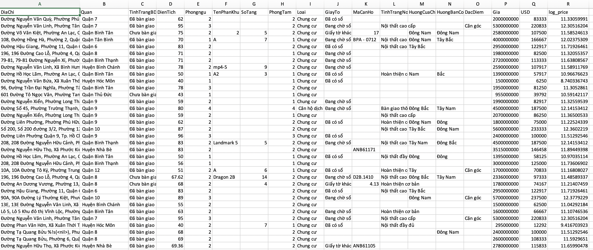 &#8594; được lưu [rawdata.csv](./Chotot/rawdata.csv)

- **Mô tả các biến**:
  - **DiaChi:** địa chỉ của chung cư, ở thành phố Hồ Chí Minh
  - **TinhTrangBDS:** là chung cư này đã bàn giao chưa, hay vẫn còn đang trong quá trìnhg xây dựng.
  - **DienTich:** diện tích thực ở(sử dụng) trên sổ hồng, đơn vị: **triệu/m2**.
  - **PhongNgu:** số lượng phòng ngủ.
  - **TenPhanKhu:** căn hộ đó thuộc block nào trong khu chung cư ấý. Vì 1 khu chung cư có rất nhiều block, các block ở vị trí khác nhau sẽ có giá khác nhau.
  - **SoTang:** căn hộ nằm ở tầng thứ mấy.
  - **PhongTam:** số lượng nhà vệ sinh.
  - **Loại:** chung cư hay nhà ở xã hội.
  - **GiayTo:** giấy tờ pháp lý của căn hộ, có đang tranh chấp hay không, có hợp pháp hay không.
  - **MaCanHo:** mã căn hộ (giống như số nhà).
  - **TinhTrangNoiThat:** căn hộ đã có nội thất hay chưa(sofa, lò vi sóng, máy lạnh,...).
  - **HuongCuaChinh:** hướng cửa chính của căn hộ.
  - **HuongBanCong:** hướng ban công của căn hộ.
  - **DacDiem:** Đặc điểm căn hộ ( căn trong góc, hay căn chính giữa,...).
  - **Gia:** giá bán của căn hộ.
     
- **Tiền xử lý dữ liệu:**
  - Chỉ lấy các dòng dữ liệu có dữ liệu về: diện tích, phòng ngủ, phòng tắm và giá. Và đổi giá tiền từ VNĐ 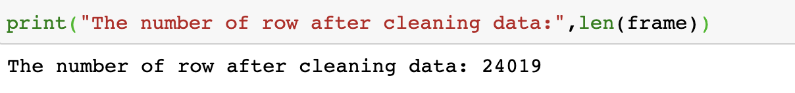 USD (theo tỉ giá 1$2 ~ 24000)
  - Dữ liệu sau khi xử lý còn 
  - Cái nhìn tổng quan về data sau khi clean: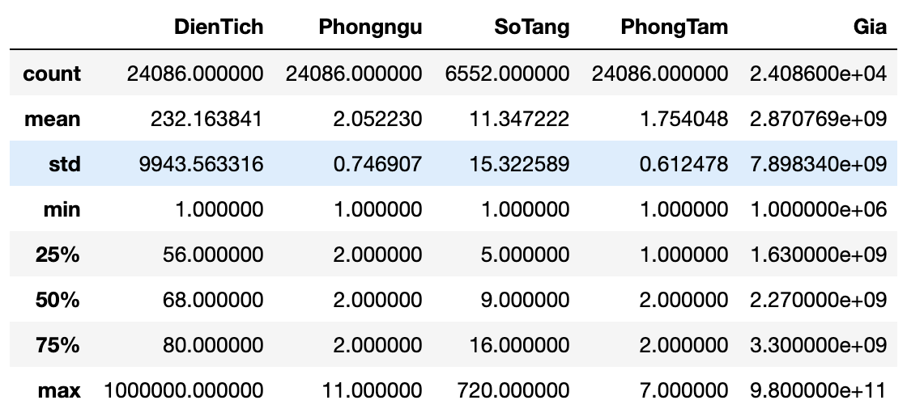
    &#8594; được lưu [dataset.csv](./Chotot/.ipynb_checkpoints/dataset.csv)
     
- **Trực quan hoá dữ liệu:** 

  - Trực quan dữ liệu giá trị **dạng số**: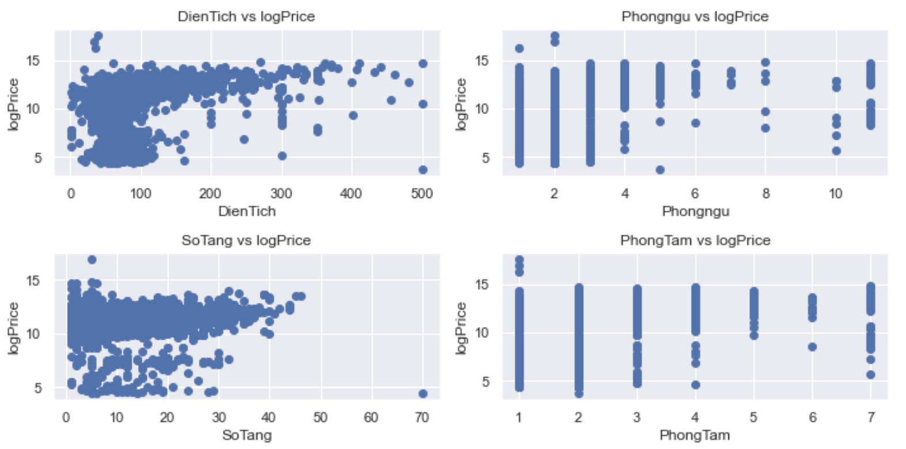
    &#8594; phòng ngủ và phòng tắm không ảnh hưởng nhiều đến giá  
  - Tương quan giữa **quận** và **giá**: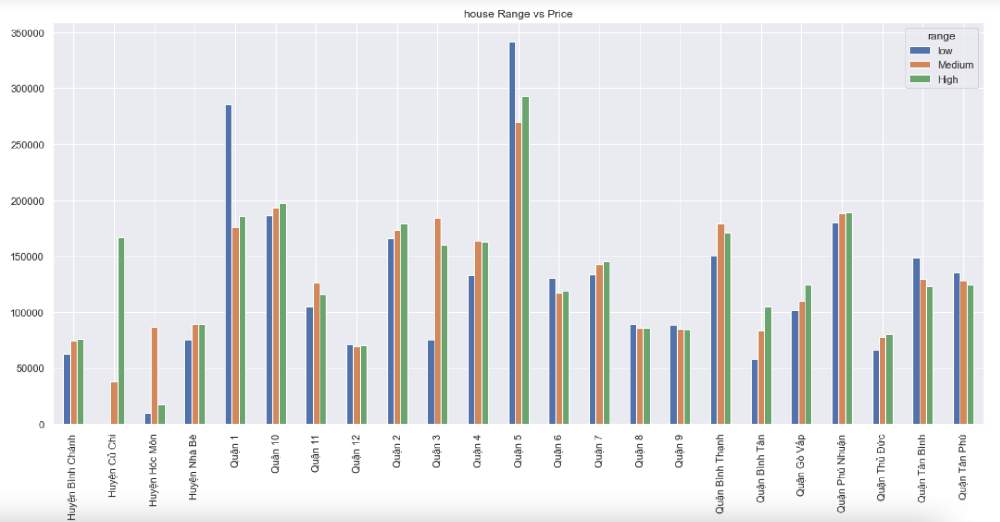
    &#8594; **Quận 5 , Quận 10, Quận 1 , Quận Phú Nhuận** là những quận có giá chung cư **cao nhất**  
  - Tương quan giữa **tình trạng bđs** và **giá**: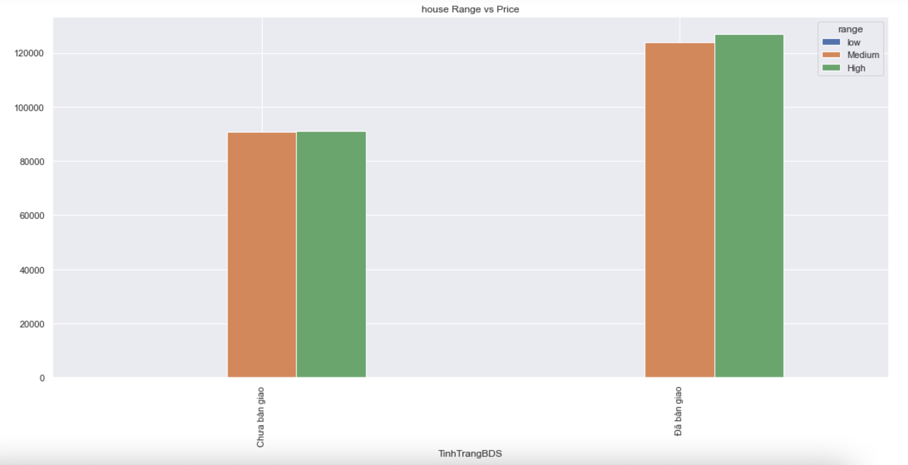
    &#8594; Có thể thấy những **chung cư đã được bàn giao** có **giá cao hơn** so với **chưa được bàn giao**  
  - Tương quan giữa **tình trạng nội thất** và **giá**: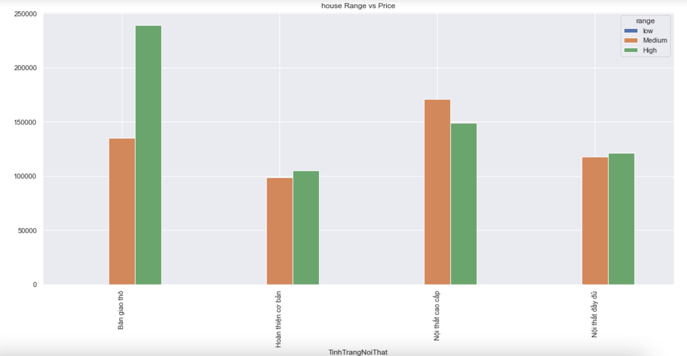
    &#8594; Nội thất được bàn giao thô được ưa chuộng trong những khu căn hộ với giá cao  
  - Tương quan giữa **loại chung cư** và **giá**: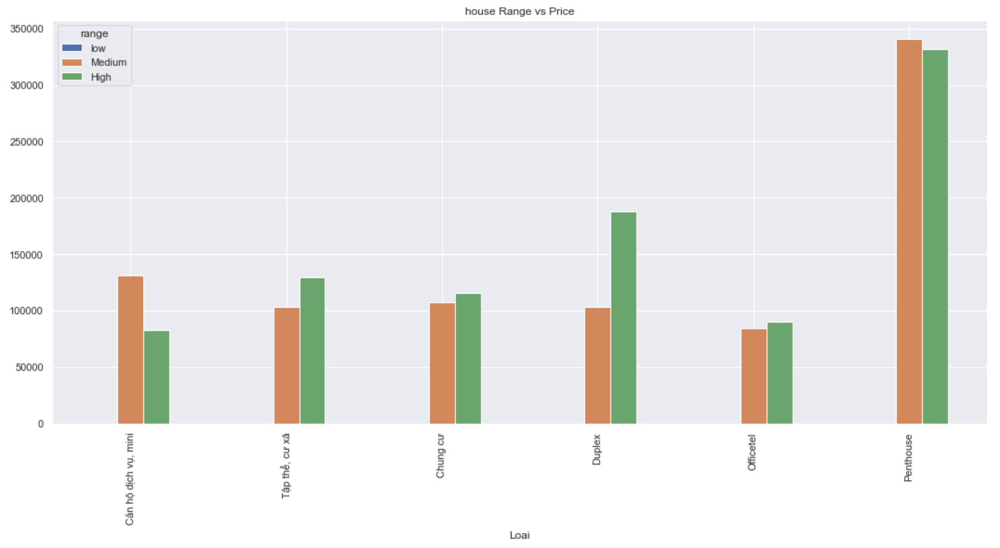
    &#8594; Những căn chung cư có **giá trung bình đến cao** thường là **penthouse**  
  - Một số tương quan khác: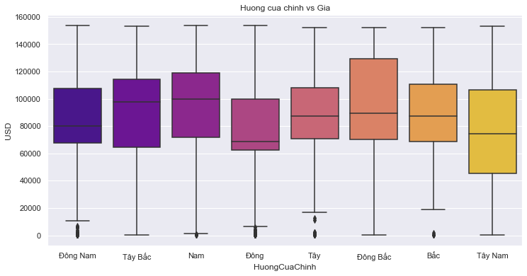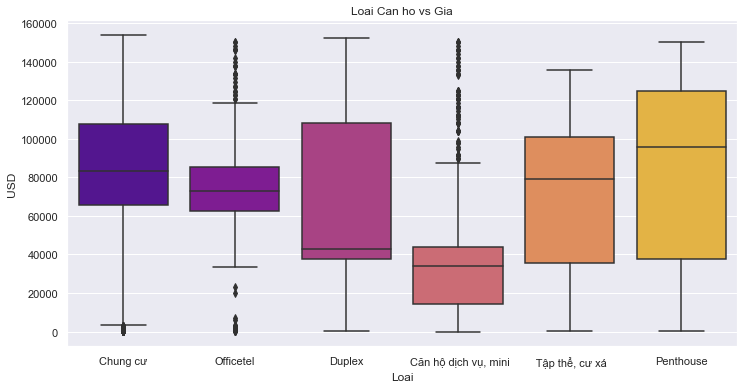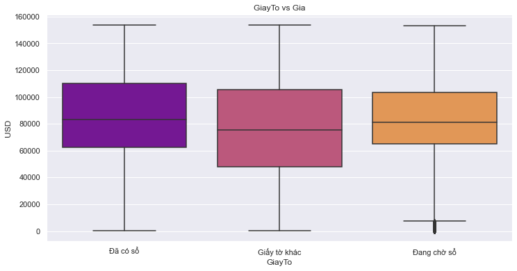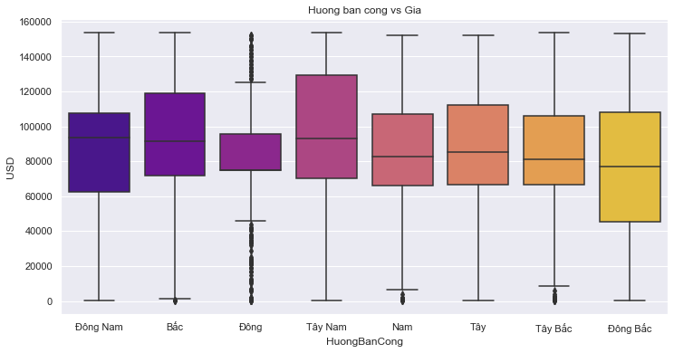

  &#8594; Có thể thấy trường dữ liệu **giấy tờ** **không** ảnh hưởng quá nhiều tới **giá nhà**  

- **Chạy thuật toán đoán giá**:

  - **Train tập dữ liệu với thuật toán Linear Regression:**

    - Chi tiết được trình bày trong file Predict.ipynb
    - Kết quả: 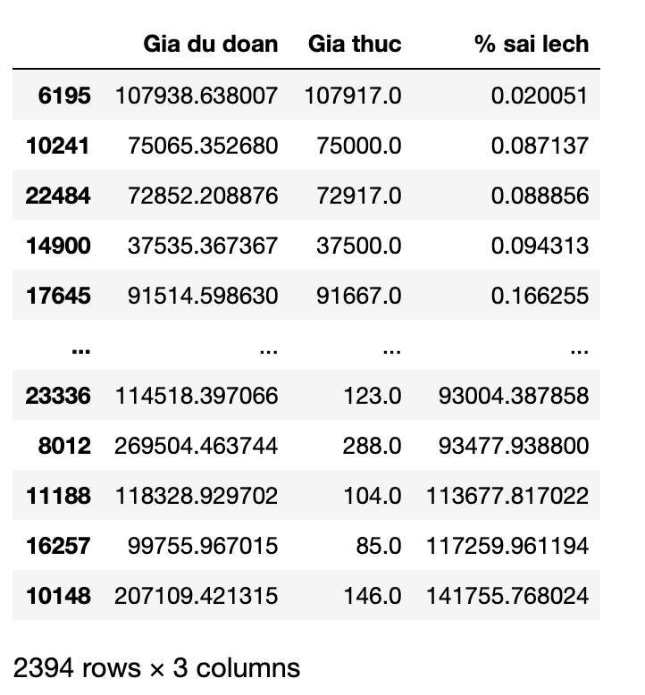

    &#8594; **Nhận xét:** Có thể thấy mô hình fit với những căn nhà có giá thấp cho tới trung bình . Còn những căn nhà ở mức cao thì các thông số đưa ra trong bộ dataset sẽ không còn ảnh hưởng tới mức giá nữa (đặc biệt là những outliner mạnh hay những data nhiễu được đưa vào thì dự đoán sẽ sai lệch rất lớn ).

    - Độ trung bình sai lệch: 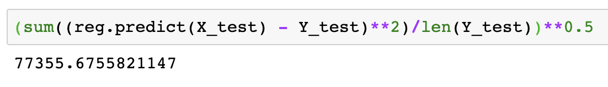
      &#8594; **Nhận xét:** Sai lệch trung bình của dataset là khoảng **77355 usd** với lý do đã kể trên

  - **Train tập dữ liệu với thuật toán Logistic Regression và Linear Regression:**
    - Ý tưởng: Chia giá tiền các căn chung cư thành 4 mức giá từ thấp -> cao và thực hiện logis data dựa theo mức rank này. Mỗi data test được đưa vào sẽ được phân loại vào 1 trong 4 mức kể trên . Từ đó lựa chọn mô hình linear phù hợp để chạy thuật toán dự đoán cho ra kq tốt nhất
    - Chi tiết được trình bày trong file code Predict.ipynb

<h2>4. Hướng dẫn chạy các file code</h2>

- **Bài toán:dự đoán giá nhà**
  - **Chotot_Scraping_Data.ipynb:** script thu thập data nhà từ trang cho tốt
  - **rawdata.csv:** data sau khi được crawl (data thô - chưa qua xử lý)
  - **dataset.csv:** data sau khi trải qua quá trình xử lý
  - **links_chotot.csv:** link của các ngôi nhà trên trang chợ tốt, ứng vói mỗi ngôi nhà sẽ crawl thông tin chi tiết.
  - **Predict.ipynb:** file thực hiện tiền xử lý dữ liệu và training data  
